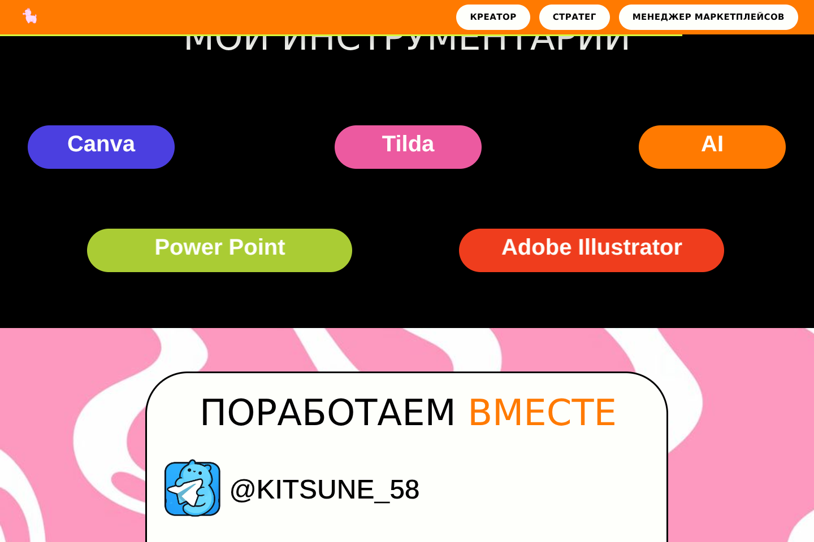

# Васильева Анна — лендинг-портфолио

Портфолио креатора, стратега и менеджера маркетплейсов. Экспорт из Figma Make
(React 19 + Vite 8 + Tailwind CSS 4) с доработками интерактива.

## Превью

| Шапка (иконка + фиксированное меню) | Секция «Инструментарий» |
| --- | --- |
|  |  |

Полная страница: [preview/05-full-desktop.png](preview/05-full-desktop.png) ·
Мобильная версия: [preview/06-mobile.png](preview/06-mobile.png)

## Что доработано

1. **Иконка вместо текста «Васильева Анна»** — векторный текст в шапке заменён
   на иконку ламы; сам заголовок-имя на первом экране сохранён.
2. **Зелёные бегущие полосы больше не наслаиваются** — положение анимированных
   полос выровнено по геометрии исходного макета (учтён сдвиг центра поворота:
   162.2px и 1576.2px вместо 126.51px и 1540.5px), поэтому статичные полосы из
   макета полностью перекрываются и не «двоятся».
3. **Фиксированное верхнее меню при прокрутке** — появляется после 170px,
   прячется при прокрутке вниз и возвращается при прокрутке вверх, с
   прогресс-баром чтения. Кнопки ведут к разделам (плавный скролл с учётом
   масштаба холста).
4. **Анимации по скроллу** — все ключевые блоки появляются по IntersectionObserver
   со стаггер-задержками (`data-reveal` / `data-delay`).
5. **Премиальные микро-взаимодействия** — hover-эффекты у навигационных пилюль,
   скилл-пилюль, карточки контактов и иконок; «плавающая» лама; fade-in страницы;
   бегущие строки ставятся на паузу при наведении; плавные якорные переходы;
   уважение `prefers-reduced-motion`.

Дополнительно:
- шрифты (Nunito variable + Arimo, кириллица включена) подключены локально через
  `@fontsource*` — сайт больше не зависит от Google Fonts CDN;
- удалены невидимые изображения-референсы за пределами холста (−3.5 МБ);
- добавлены favicon, `title` и мета-описание на русском, `lang="ru"`;
- крупный заголовок первого экрана подогнан по ширине (Nunito шире исходного
  Citrica Cyrillic).

## Запуск

```bash
npm install
npm run dev      # http://localhost:8443
npm run build    # сборка в dist/
npm run preview  # предпросмотр сборки
```

Альтернативно — pnpm (`pnpm install && pnpm dev`).

## Структура

- `src/App.tsx` — обёртка страницы: масштабирование холста 1440px, фиксированная
  шапка, бегущие полосы, scroll-reveal, навигация по якорям
- `src/imports/ГлавнаяСтраница/index.tsx` — pixel-perfect компонент макета
- `Pixel-Perfect Landing Page.zip` — исходный архив экспорта Figma Make
- `preview/` — скриншоты собранной версии
